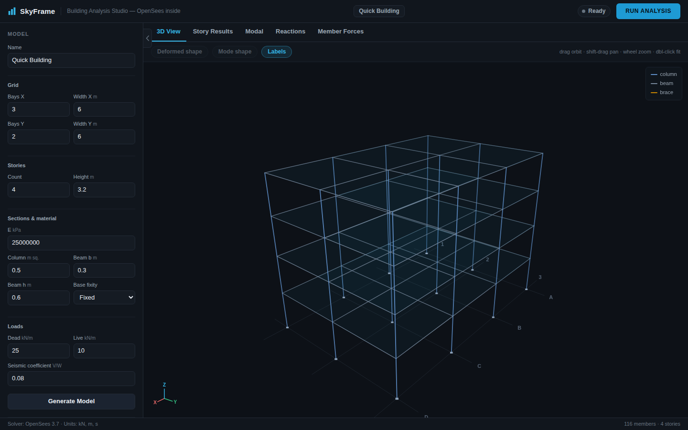
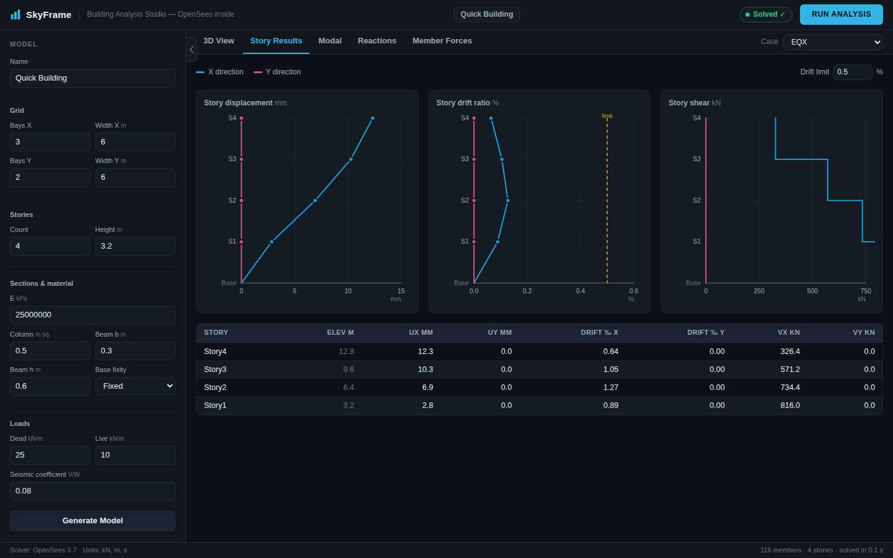
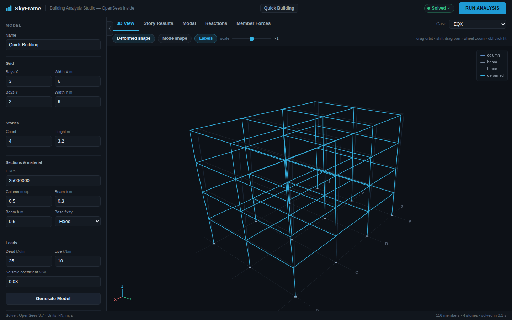
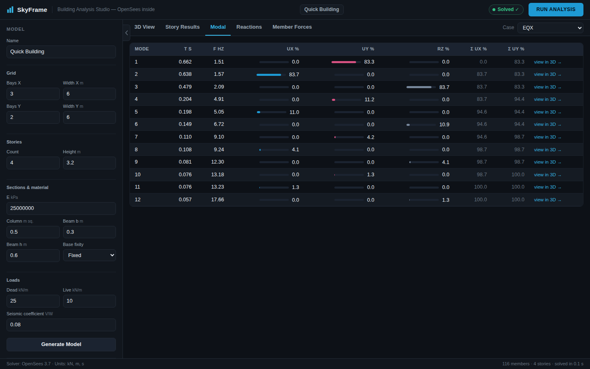

# SkyFrame — Building Analysis Studio

**Your personal ETABS-style structural analysis app, powered by [OpenSees](https://opensees.berkeley.edu/).**

SkyFrame wraps the research-grade, open-source OpenSees finite-element framework
(the solver trusted by earthquake-engineering researchers worldwide) in a fast,
modern, building-centric interface: grids, stories, frames, rigid diaphragms,
load patterns/cases/combinations, story drifts and modal results — the ETABS
workflow, with a solver whose source code you can actually read.

```
skyframe/
├── skyframe/
│   ├── core/          # building data model + parametric building generator
│   │   ├── model.py   #   materials, sections, stories, members, loads, combos
│   │   └── builder.py #   quick_building(): grid × stories wizard
│   ├── engine/        # OpenSeesPy translation layer + analyses
│   └── api/           # Flask REST API + single-page web app
│       └── web/       #   3D viewer, story charts, modal/reaction/force tables
├── tests/             # validation suite vs published benchmarks
├── examples/          # scripted example buildings
└── CONTRACT.md        # internal API contract
```

## Why SkyFrame over a black-box commercial tool?

* **Transparent solver** — every stiffness term comes from OpenSees, an
  open-access framework developed at UC Berkeley (PEER). No license dongle,
  no black box: the analysis code is auditable and citable.
* **Validated, not just trusted** — `tests/` reproduces published OpenSees
  example results *exactly* and cross-checks the engine against independent
  closed-form hand solutions (the same kind CSI's own ETABS *Software
  Verification* manual uses). Run `pytest` yourself, any time.
* **Modern UX** — a dark, keyboard-friendly single-page app with a 60 fps 3D
  viewer, animated mode shapes, linked story-result charts and sortable force
  tables. No ribbon toolbars from 2003.
* **Scriptable by design** — the whole model is plain Python dataclasses;
  every result is plain JSON. Automate parametric studies in a for-loop.

## Screenshots (live OpenSees solves)

| 3D model | Story results (EQX) |
|---|---|
|  |  |
| **Deformed shape overlay** | **Modal results** |
|  |  |

## Quickstart

```bash
pip install -r requirements.txt        # openseespy, numpy, flask, pytest
# Linux: openseespy needs BLAS/LAPACK: apt-get install libblas3 liblapack3

python3 -m skyframe.api.server         # → http://127.0.0.1:8600
```

Or script it:

```python
from skyframe import quick_building, OpenSeesEngine

model = quick_building(bays_x=4, bays_y=3, stories=8, quake_coeff=0.1)
results = OpenSeesEngine(model).run().to_dict()
print(results["modal"]["periods"][:3])
print(results["cases"]["EQX"]["story"]["Story1"]["drift_x"])
```

See `examples/four_story_office.py` for a complete scripted run.

## Analysis capabilities (v0.1)

| Feature | Status |
|---|---|
| 3D elastic frame analysis (columns / beams / braces) | ✅ |
| Rigid floor diaphragms with auto mass (from dead load or explicit) | ✅ |
| Linear static load cases + linear load combinations | ✅ |
| Equivalent-static seismic pattern (auto triangular distribution) | ✅ |
| Eigenvalue / modal analysis with mass-participation ratios | ✅ |
| Story drifts, story shears, base reactions, member local forces | ✅ |
| Response-spectrum, time-history, P-Delta, nonlinear hinges | 🚧 roadmap (OpenSees supports all of these) |

## Validation

Run the suite:

```bash
cd skyframe && python3 -m pytest tests/ -v
```

The suite pins SkyFrame's results to:

1. **Published OpenSees example outputs** — e.g. the official *Basic Truss*
   example (OpenSees wiki): computed `ux = 0.53009277 in`,
   `uy = -0.17789364 in` must match to 8 significant figures.
2. **Independent closed-form mechanics** — cantilever `PL³/3EI`, simply
   supported beam `5wL⁴/384EI` and `wL²/8`, portal-frame drift via an
   independent numpy stiffness assembly, SDOF/shear-building periods via
   independent eigenvalue solutions — the same style of independent hand
   verification CSI publishes for ETABS.
3. **Invariants** — static equilibrium of base reactions vs applied loads,
   exact linear superposition of combinations, modal mass participation
   closure.

See `tests/VALIDATION.md` for the benchmark-by-benchmark matrix with sources.

## Units

Consistent kN · m · tonne · s (E in kPa). The UI reports mm and ‰ drift where
conventional.

## License / attribution

SkyFrame is an independent open-source application built on
[OpenSeesPy](https://github.com/zhuminjie/OpenSeesPy). "ETABS" is a trademark
of Computers & Structures, Inc. — SkyFrame is not affiliated with CSI; ETABS
verification examples are referenced only as independent benchmarks.
